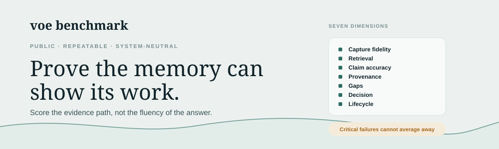
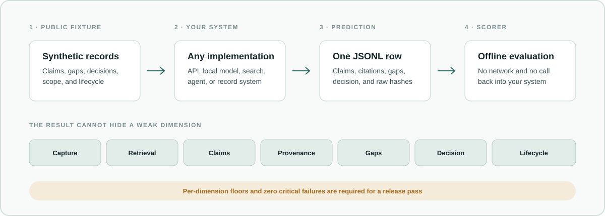

<!--
This is the public entry point for understanding and running Voe Benchmark.
Keep the first run small, the scoring limits visible, and product claims out.
Detailed contracts belong in BENCHMARK.md and ADAPTER-PROTOCOL.md.
-->

<p align="center">
  
</p>

<p align="center">
  <a href="#your-first-result">Run the benchmark</a> ·
  <a href="BENCHMARK.md">Read the scoring contract</a> ·
  <a href="ADAPTER-PROTOCOL.md">Build an adapter</a> ·
  <a href="https://docs.runvoe.com/">Explore Voe</a>
</p>

Can a company-memory system show what it knows, why it believes it, and what
it still cannot prove?

Voe Benchmark is a public, repeatable test of the path from source capture
to a governed answer. It measures source preservation, retrieval, claim
support, provenance, gap reporting, lifecycle behavior, and action restraint.

The fixtures are synthetic. The scorer is system-neutral. You do not need a
Voe account, Voe's private source, or network access to run it.

## What the benchmark follows

<p align="center">
  
</p>

The benchmark does not reward a fluent answer that outruns its evidence. Each
case includes source records, expected claims, required citations, known gaps,
the correct decision posture, and lifecycle facts such as redaction or access
scope. Your system returns one prediction per case. The scorer checks the file
without calling your system or the network.

## Your first result

Requirements: Python 3.11 or newer. There are no third-party runtime
dependencies.

```bash
PYTHONPATH=src python3 -m emb validate
PYTHONPATH=src python3 -m emb score examples/reference-predictions.jsonl
```

The reference predictions score 100 by construction. They verify that the
corpus and scorer agree. They are not a product result.

Create the two files needed for your own run:

```bash
PYTHONPATH=src python3 -m emb export --output workset.jsonl
PYTHONPATH=src python3 -m emb template --output predictions.jsonl
```

Give `workset.jsonl` to your adapter or system. Populate
`predictions.jsonl`, then score it:

```bash
PYTHONPATH=src python3 -m emb score predictions.jsonl --json
```

An editable install is optional. `python3 -m pip install -e .` provides the
shorter `emb` command.

## Seven questions, one evidence contract

| Dimension | The question the scorer asks |
| --- | --- |
| Capture fidelity | Did the system preserve the bytes that arrived? |
| Retrieval | Did it find the records needed for the question? |
| Claim accuracy | Did it make the labeled claims and avoid invented ones? |
| Provenance | Does each claim cite evidence capable of supporting it? |
| Gaps | Did it name the evidence the record still lacks? |
| Decision | Did it answer, withhold, deny, or propose action correctly? |
| Lifecycle | Did redacted, superseded, or unauthorized material stay out of the answer? |

A composite score cannot hide an evidence failure. A release pass also
requires the published floor in every dimension and zero critical failures.
See [BENCHMARK.md](BENCHMARK.md) for weights, floors, and failure rules.

## The cases feel like real work

The first corpus contains 11 cases across seven domains:

| Domain | Example evidence problem |
| --- | --- |
| Manufacturing | A sensor is in range, but the QA release is missing. A newer certificate supersedes an older one. |
| Contracts | An invoice is due, but no provider receipt proves payment. A draft amendment cannot replace the signed agreement. |
| Hiring | A candidate accepted an offer, but an agent note cannot stand in for the provider's background report. |
| Incident response | A bot says the incident is resolved, while an external monitor establishes the recovery time. |
| Customer support | A promised refund conflicts with the payment provider's declined transaction. |
| Construction | Work is discussed, but the contract still requires a signed change order. |
| Cross-domain | Access is denied, redacted content stays absent, and an attempted action is not mistaken for provider acceptance. |

Manufacturing, contracts, and hiring also include example domain vocabularies.
They show how domain meaning can be expressed. A candidate system does not
have to adopt their schema.

## Connect any system

The benchmark interface is JSONL, not an SDK. An adapter may call an API, run a
local model, query a search system, or translate another record format. It
must emit the published prediction shape and preserve stable case identifiers.

Start with [ADAPTER-PROTOCOL.md](ADAPTER-PROTOCOL.md). Publish the adapter with
any result so another person can see how source records became predictions.

## What a result means

A passing result means the submitted predictions met the published labels,
dimension floors, and safety conditions for this small synthetic corpus. It
does not establish production accuracy, latency, security, legal compliance,
model quality, or performance on a private company's data.

The corpus and labels are public. This is a transparent conformance benchmark,
not a hidden leaderboard. A reproducible result should name:

- the exact benchmark commit;
- the system and version tested;
- the adapter commit and configuration;
- the prediction file; and
- the command used to score it.

## What is public

This repository contains benchmark code, synthetic fixtures, schemas, and
examples. Voe's product source remains private. The benchmark is MIT-licensed.
That license does not apply to Voe container images, binaries, services, or
fineSample trademarks.

Voe is one implementation of the evidence infrastructure this benchmark is
designed to exercise. Its public product and operator documentation is at
[docs.runvoe.com](https://docs.runvoe.com/). Using Voe is not required, and Voe
receives no scoring privilege.

## Contributing

New cases need a falsifiable expected result, synthetic or properly licensed
evidence, and a reason the case cannot be passed by plausible prose alone. See
[CONTRIBUTING.md](CONTRIBUTING.md).
